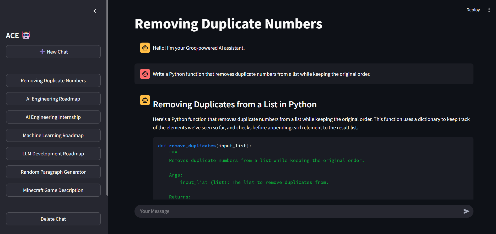

# 🚀 ACE — Local ChatGPT-Style Chatbot (Groq + Streamlit)

ACE is a lightweight, ChatGPT-style conversational AI app built with **Python**, **Streamlit**, and the **Groq LLaMA-3.1 8B Instant model**.  
This project was created for learning, experimenting, and showcasing backend + UI engineering skills.  
The interview board can use this repository to understand how the system is designed, structured, and implemented.

---

# 📸 User Interface (Screenshot)



*(The interface includes a left sidebar for chat management and a clean, ChatGPT-like chat UI on the right.)*

---

# ✨ Features

### ✅ **1. Multi-Chat System**
- Every conversation is stored in `/chats` as a JSON file.
- Chats have auto-generated titles (based on the first user input).
- Switching between chats is instant.

### ✅ **2. Chat Management UI**
- **New Chat** button  
- **Scrollable chat list**  
- **Delete Chat** (sticky bottom button)  
- Dynamic highlighting of the selected chat.

### ✅ **3. ChatGPT-Style Streaming Responses**
- Messages from the assistant appear token-by-token (typing animation).
- Implemented using Groq API streaming.

### ✅ **4. Local JSON Database**
- Every chat message is stored locally in a structured JSON format.
- The app can load, save, update, and delete chat files dynamically.

### ✅ **5. Clean, Professional Streamlit UI**
- Custom CSS added for:
  - Scrollable sidebar
  - Chat layout improvement

---

# 🧠 Tech Stack

| Layer | Technology |
|-------|------------|
| Frontend UI | **Streamlit** |
| AI Model | **Groq Llama-3.1-8B-Instant** |
| Backend Logic | Python |
| File Storage | JSON |
| Environment Handling | python-dotenv |

---

# 📂 Project Structure

```
📦ACE
 ┣ 📂chats/                # Stored chat history (.json)
 ┣ 📜app.py               # Main Streamlit user interface
 ┣ 📜chat_manager.py      # CRUD operations for chats
 ┣ 📜llm.py               # Groq API streaming + title generation
 ┣ 📜.env (not uploaded)  # API key
 ┗ 📜README.md            # Project documentation
```

---

# 🧩 File-By-File Explanation

### **app.py**
Handles:
- Streamlit page setup  
- Sidebar rendering  
- Chat display  
- Input handling  
- Streaming assistant response  
- Auto title generation  
- Saving messages  

This is the main entry point of ACE.

---

### **chat_manager.py**
Responsible for:
- Creating new chat files  
- Loading existing chats  
- Saving messages  
- Deleting chats  
- Listing chats in sorted order  

This acts like a **local database manager** for all chats.

---

### **llm.py**
Handles:
- Connecting to Groq API  
- Streaming replies (token by token)  
- Generating short chat titles  

This is the AI engine of the project.

---

# 🤖 Model Used: LLaMA-3.1 8B Instant (Groq)

Ultra-fast inference, low latency.  
Perfect for building ChatGPT-style conversational apps.

---

# 🧪 Use Case

This project is meant for:

🔹 Experimentation  
🔹 Showcasing Streamlit + API engineering  
🔹 Understanding chat memory storage  
🔹 Interview demonstration  
🔹 Reference architecture for your own chatbot apps  

It is **not** meant for production deployment.

---

# 🧩 How the System Works — Overview Diagram

```
User Input → Streamlit UI (app.py)
         → Message added to session + saved to JSON
         → llm.py sends all messages to Groq API
         → Response streamed back token-by-token
         → Displayed in chat window
         → Saved back to JSON via chat_manager.py
```
---

## 🧑‍💻 Author

**Yahan**  
🎓 Software Engineering Student | 💻 Data Science & NLP Enthusiast  


---

⭐ **If you like this project, please give it a star!**


